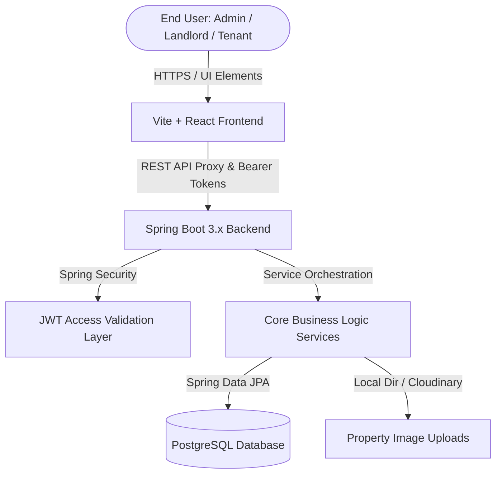
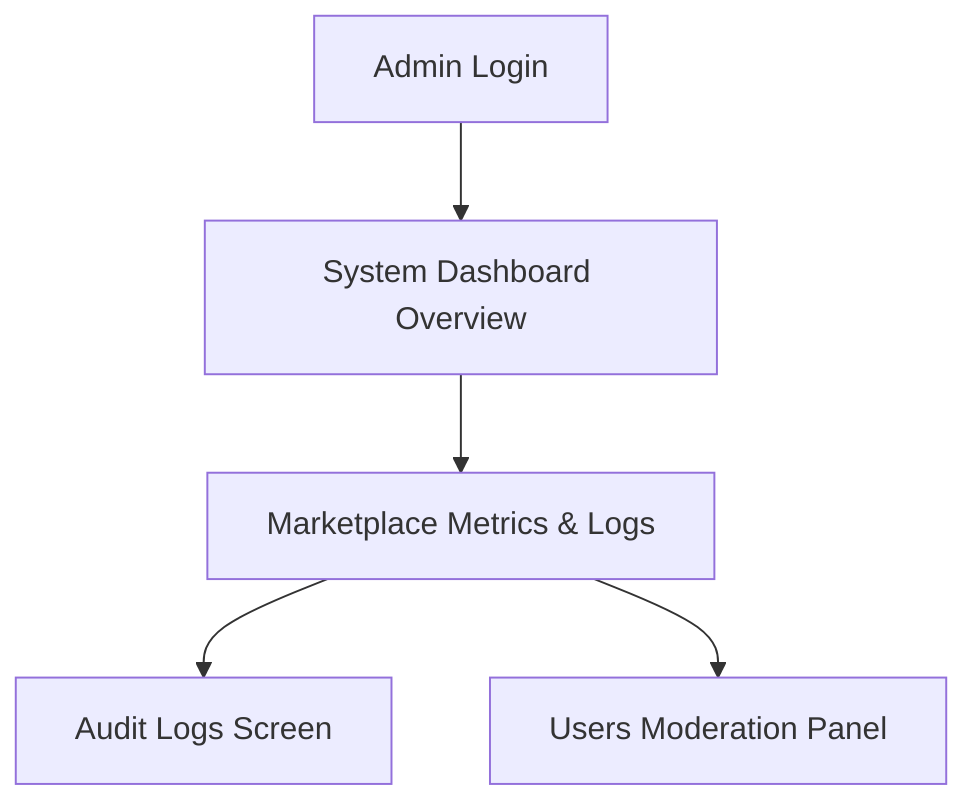
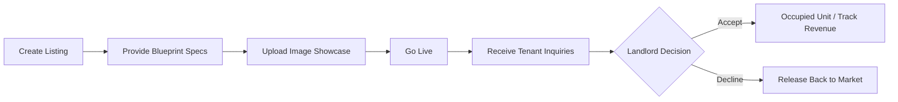

# 📖 RentalHub (Elite Rentals) — The Book of the System
## Complete Usability, Technical & Administrative Playbook

Welcome to **RentalHub** (also known as *Elite Rentals*), a state-of-the-art, production-grade, monolithic web application designed for seamless house rental discovery and property portfolio management. 

This master user manual is the absolute source of truth ("the book of the system") for understanding, configuring, and operating every single component of this platform. It has been curated specifically for **Elite Renters (Tenants)**, **Verified Hosts (Landlords)**, and **System Administrators**.

---

## 🗺️ System Architecture Overview

RentalHub is architected with a decoupled yet unified system layout. It pairs a light-adaptive, premium React frontend with a high-performance Spring Boot API gateway and PostgreSQL datastore.



- **Core Technologies**: Spring Boot 3.x, Spring Security, JWT, JPA/Hibernate, Flyway migrations, PostgreSQL, React 18, Vite, Framer Motion, and Tailwind CSS / custom design systems.
- **Unified Build Protocol**: Features a combined Maven lifecycle. Building the backend with `./mvnw clean install` automatically transpiles the React frontend, bundles its assets into `/src/main/resources/static`, and outputs a standalone, fully-executable runner JAR.

---

## 👥 Core Functional Roles & Access Controls (RBAC)

Access to the RentalHub command panel is partitioned using secure **Role-Based Access Control (RBAC)**. The following matrix outlines the permissions of each functional role:

| Feature / Operations | Elite Renter (Tenant) | Verified Host (Landlord) | System Admin | Guest (Unauthenticated) |
| :--- | :---: | :---: | :---: | :---: |
| **Browse / Search Marketplace** | ✔️ | ✔️ | ✔️ | ✔️ |
| **View Listing Details** | ✔️ | ✔️ | ✔️ | ✔️ |
| **Add / Delete Favorites** | ✔️ | ❌ | ❌ | ❌ |
| **Submit Secure Viewing Inquiries** | ✔️ | ❌ | ❌ | ❌ |
| **Submit Lease Booking Requests** | ✔️ | ❌ | ❌ | ❌ |
| **Create & Publish Listings** | ❌ | ✔️ | ✔️ | ❌ |
| **Edit & Delete Personal Listings** | ❌ | ✔️ | ✔️ | ❌ |
| **Accept / Decline Booking Requests**| ❌ | ✔️ | ❌ | ❌ |
| **View Revenue & Occupancy Analytics**| ❌ | ✔️ | ✔️ | ❌ |
| **Moderate / Edit All Platform Users** | ❌ | ❌ | ✔️ | ❌ |
| **View Security & System Audit Logs** | ❌ | ❌ | ✔️ | ❌ |

---

## 📖 Step-by-Step Usability Guide per Role

### 1. 🛡️ System Administrator Playbook
As a System Administrator, you hold ultimate operational oversight of the platform.



- **Operational Console Access**:
  Upon authenticating as an Admin, your sidebar populates with exclusive modules: **Dashboard**, **Properties**, **Applications**, **Audit Logs**, and **Settings**.
- **System Metrics Monitoring**:
  The main dashboard aggregates metrics:
  - *Total Marketplace Listings*: Complete size of the active database.
  - *Booking Queries*: Global platforms transactions (aggregate transactions of all landlords and tenants).
  - *System Logs Count*: Total registered logs in the audit trace database.
  - *Active Alerts count*: Track system events that require checks.
- **Audit Logs Investigation**:
  Navigate to **Audit Logs** to view a chronological history of security actions taken on the system.
  - Failures and database exceptions are automatically marked with special caution tags.
  - Each entry lists the `Action type`, the exact `User Email` who performed it, the `Details` of the transaction, and a high-resolution `TIMESTAMPTZ` record.
- **User Database Moderation**:
  Administrators can access `/api/v1/admin/users` to moderate active accounts, update user status details, or remove stale database profiles.

---

### 2. 🏡 Verified Host (Landlord) Playbook
Verified Hosts manage property inventories, review lease inquiries, and track financial yields.



#### A. Managing your Property Portfolio
- **Adding a Listing**:
  1. Click **+ Add Listing** inside the Properties panel.
  2. **Property Blueprint Setup**:
     - *Listing Title*: Input a compelling title (e.g. *Minimalist Loft with Skyline Views*).
     - *Location / City*: Enter precise geo-parameters (e.g. *Park Slope, Brooklyn*).
     - *Availability Status*: Choose between `Live & Available`, `Rented`, or `Hidden/Unavailable`.
     - *Phone & Contact Email*: Input specific contact parameters which override the account credentials for this listing.
     - *Monthly Rent ($)*: Input the lease rate.
     - *Total Rooms*: Set number of bedrooms.
  3. **Provide Description**: Write a high-yield description. Detailed descriptions increase lease rates by 40%.
  4. **Visual Showcase Uploads**:
     - Drag and drop up to 10 high-resolution images.
     - Max file size is **5MB** per image.
     - Supported formats: `JPG`, `PNG`, and `WEBP`.
  5. Click **Publish Property** to publish the listing.
- **Editing & Deleting Listings**:
  Under the **Properties** tab, hosts can click the pencil icon (**Edit**) to adjust properties, or click the trash can icon (**Delete**) to remove properties from the database.

#### B. Booking/Coordination Workflows
- **Reviewing Applications**:
  When tenants send booking requests, they appear under the **Requests** tab.
- **Making Decisions**:
  Each request showcases:
  - Tenant identity email.
  - Requested lease duration (`Start Date` to `End Date`).
  - Personal message inquiry.
  - Click **Accept Offer** to approve the lease. This sets the listing's availability automatically to `Rented` and registers an active revenue flow.
  - Click **Decline** to release the property back into the public search pool.

#### C. Dashboard Analytics
- **Live Session Tracker**: A built-in session stopwatch allows hosts to benchmark active sessions.
- **Occupancy Progress Gauge**: A beautiful striped progress arch displays the current active rental occupancy percentage of your portfolio.
- **Monthly Revenue estimates**: Automatically sums the prices of occupied listings.

---

### 3. 🔑 Elite Renter (Tenant) Playbook
Elite Renters browse high-yield properties, bookmark favorites, and coordinate directly with hosts.

#### A. Finding a Premium Space
- **Marketplace Browsing**:
  Navigate to **Browse Properties** from the home page.
- **Advanced Filters**:
  Click the **Filters** toggle to filter search parameters:
  - *Location*: Filter by city, ZIP, or neighborhood.
  - *Max Price*: Set an upper limit on monthly rent.
  - *Min Beds*: Set the minimum room count.
  - *Status*: Toggle between `All`, `Available`, and `Rented` listings.
- **Layout Selection**:
  Switch between a beautiful **Grid view** (perfect for scanning high-yield listing images) and a clean **List view** (which shows longer description snippets and metadata).

#### B. Contacting Landlords & Lease Applications
- **Reviewing Details**:
  Click **View Details** on any property card. You can view the image gallery, location, bedrooms count, verified landlord credentials, and key amenities (such as *High-Speed Fiber*, *Private Parking*, *Garden*, *Air Conditioning*, *24/7 Security*, *Pet Friendly*).
- **Secure Viewing Inquiry**:
  If logged in, you can type a direct message (e.g. *"Hi, I'm interested in viewing this space next Tuesday morning."*) and click **Send Inquiry**. This channels a direct message to the landlord's dashboard.
- **Active Lease Application**:
  To book, select your desired lease start and end dates, draft a personal application cover message, and click **Request Tour / Apply**.
- **Track Status**:
  Navigate to **Applications** in the Tenant Dashboard to track status transitions (*Pending*, *Approved*, or *Rejected*) in real-time.

---

## 📊 Database Entity Model

Flyway migrations (`V1`, `V2`, `V3`) enforce a highly-normalized PostgreSQL schema optimized with functional indexes:

```mermaid
erDiagram
    USERS ||--o{ PROPERTIES : "owns"
    USERS ||--o{ BOOKINGS : "submits"
    USERS ||--o{ FAVORITES : "bookmarks"
    USERS ||--o{ MESSAGES : "sends/receives"
    USERS ||--o{ SYSTEM_LOGS : "triggers"
    PROPERTIES ||--o{ PROPERTY_IMAGES : "has"
    PROPERTIES ||--o{ BOOKINGS : "gets"
    PROPERTIES ||--o{ FAVORITES : "bookmarked"

    USERS {
        bigint id PK
        varchar email UNIQUE
        varchar password_hash
        varchar role
        varchar full_name
        boolean active
        timestamptz created_at
    }

    PROPERTIES {
        bigint id PK
        bigint landlord_id FK
        varchar title
        text description
        varchar location
        numeric price_per_month
        integer rooms
        varchar availability
        varchar phone
        varchar contact_email
        timestamptz created_at
    }

    PROPERTY_IMAGES {
        bigint id PK
        bigint property_id FK
        varchar file_path
    }

    BOOKINGS {
        bigint id PK
        bigint property_id FK
        bigint tenant_id FK
        varchar status
        date start_date
        date end_date
        text message
        timestamptz created_at
    }

    FAVORITES {
        bigint id PK
        bigint user_id FK
        bigint property_id FK
        timestamptz created_at
    }

    MESSAGES {
        bigint id PK
        bigint sender_id FK
        bigint recipient_id FK
        text body
        timestamptz created_at
    }

    SYSTEM_LOGS {
        bigint id PK
        varchar action
        varchar entity_type
        bigint entity_id
        bigint user_id
        varchar user_email
        text details
        timestamptz created_at
    }
```

---

## ⚡ Technical API Endpoints Reference

The Spring Boot backend exposes a clean REST API under the `/api/v1` namespace:

### 1. Authentication (`/api/v1/auth`)
- `POST /register`: Registers a new user account.
  - *Payload*: `{"email": "...", "password": "...", "fullName": "...", "role": "tenant/landlord"}`
- `POST /login`: Validates credentials and returns a secure JWT bearer token.
  - *Payload*: `{"email": "...", "password": "..."}`
  - *Response*: `{"token": "eyJhb...", "type": "Bearer", "email": "...", "role": "..."}`
- `POST /logout`: Invalidates the active JWT session.
- `GET /me`: Returns details of the currently authenticated session.
- `PUT /profile`: Updates user settings (Full Name, Password).

### 2. Properties (`/api/v1/properties`)
- `GET /`: Paged search for properties.
  - *Query Params*: `location` (String), `maxPrice` (BigDecimal), `minRooms` (Integer), `availability` (PropertyAvailability), `page` (int), `size` (int).
- `GET /my`: Lists properties belonging to the currently authenticated landlord.
- `GET /{id}`: Returns detailed parameters of a single property listing.
- `POST /`: Creates a new property blueprint entry.
- `PUT /{id}`: Updates property specifications.
- `DELETE /{id}`: Removes a property listing permanently.
- `POST /{id}/images` (`multipart/form-data`): Uploads multiple file images for a property listing.

### 3. Bookings & Applications (`/api/v1/bookings`)
- `GET /`: Lists active applications for the logged-in user.
- `GET /my`: Lists rental booking applications submitted by the tenant.
- `GET /landlord`: Lists coordinate booking requests received on the landlord's properties.
- `POST /`: Submits a booking request.
- `PUT /{id}`: Updates status of a booking (Accept/Decline).
  - *Payload*: `{"status": "approved / rejected"}`

### 4. Direct Messages (`/api/v1/messages`)
- `GET /`: Retrieves direct messaging history.
- `POST /`: Sends a secure viewing message to a recipient.
  - *Payload*: `{"recipientId": 2, "body": "Hello Landlord..."}`

### 5. Favorites (`/api/v1/favorites`)
- `GET /`: Lists all bookmarked properties.
- `POST /`: Bookmarks a property listing.
  - *Payload*: `{"propertyId": 1}`
- `DELETE /{propertyId}`: Removes bookmark.

### 6. Administration (`/api/v1/admin`)
- `GET /users`: Lists all system users.
- `PATCH /users/{id}`: Partially updates user accounts (toggle active, change roles).
- `DELETE /users/{id}`: Deletes user accounts.
- `GET /stats`: Aggregates global system statistics.
- `GET /bookings`: Lists all booking requests.
- `GET /logs`: Lists security and system audit logs.

---

## 🛠️ Setup & Development Guide

### Environmental Requirements
Ensure you have the following prerequisites installed locally:
- **Java JDK 17** or higher.
- **Node.js** v20 or higher.
- **PostgreSQL** Database server.

### Local Configuration Setup
1. Create a `.env` file at the root of the workspace.
2. Configure your properties based on the following template:

```env
# PostgreSQL Database parameters
DB_URL=jdbc:postgresql://localhost:5432/house_rental
DB_USERNAME=postgres
DB_PASSWORD=your_secure_password

# Security & Storage Parameters
JWT_SECRET=6e6082f88351504749d1537f7d10b9ee51018f33bb1e0a58c0ad768490784112
JWT_EXPIRATION_MS=86400000

# Cloudinary Integration
CLOUDINARY_CLOUD_NAME=dev-storage-bucket
CLOUDINARY_API_KEY=839482175928471
CLOUDINARY_API_SECRET=aB1cD2eF3gH4iJ5kL6mN7oP8qR9sT0u

# Frontend Integration
VITE_API_URL=http://localhost:8080
```

---

## 🚀 Deployment Instructions

### 1. Dev Mode (Separate Servers)
Run backend and frontend servers independently to enable Hot Module Replacement (HMR):

- **Boot the Spring Boot Backend**:
  ```bash
  # From root directory
  ./mvnw spring-boot:run -Dspring-boot.run.profiles=dev
  ```
- **Boot the Vite React Frontend**:
  ```bash
  # Open a separate terminal window
  cd frontend
  npm install
  npm run dev
  ```
  Open [http://localhost:5173](http://localhost:5173) to view the client. API calls will be automatically proxied to port `:8080`.

### 2. Production Deployment (Unified Monolithic Build)
To compile and package the entire system into a single executable JAR file:

```bash
# In the root folder:
./mvnw clean install

# Launch the unified application JAR:
java -jar target/house_rental-0.0.1-SNAPSHOT.jar
```
Your application will be served at [http://localhost:8080](http://localhost:8080).

---

## Admin Account

The PostgreSQL database starts fresh with only the predefined administrator account. Create landlord and tenant users through the registration page before testing role-specific workflows.

| Functional Role | Username / Email | Plaintext Password |
| :--- | :--- | :--- |
| **System Admin** | `admin@gmail.com` | `admin` |

---
*Developed with ❤️ by The_Agaba. Designed for visual and operational excellence.*
